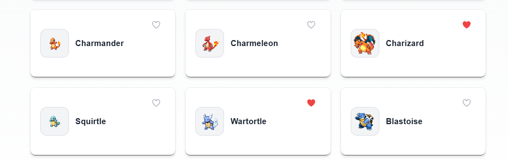

# Pokedex Ionic App

Este projeto é um aplicativo mobile híbrido desenvolvido com Ionic e Angular, que consome a API pública **PokeAPI** para exibir uma lista de Pokémons, detalhes individuais, e gerenciar uma lista de favoritos.

---

## Abordagem e Estilo de Codificação

- **Componentes Standalone:** Utilizamos a abordagem de componentes standalone do Angular para modularidade, simplificando a manutenção e carregamento dinâmico.
- **Injeção de Dependências:** Serviços são providos via DI do Angular, garantindo baixo acoplamento e alta testabilidade.
- **Serviços REST:** Comunicação com a API via HttpClient, com tratamento assíncrono moderno utilizando Observables e Promises.
- **Async/Await:** Uso extensivo para controle simples e claro do fluxo assíncrono, aumentando legibilidade e robustez.
- **Paginação:** Implementada paginação na listagem para otimizar desempenho e experiência do usuário.
- **Favoritos:** Sistema persistente de favoritos utilizando `@ionic/storage-angular`, com interface responsiva para adicionar/remover.
- **Navegação:** Navegação fluida entre telas com o router do Angular e estrutura com abas para usabilidade intuitiva.
- **Responsividade:** Layout adaptado para diferentes orientações e tamanhos de tela em dispositivos móveis.
- **Boas práticas:** Seguindo Clean Code, SOLID e separação clara de responsabilidades entre componentes, serviços e camadas.
- **Testes Unitários:** Cobertura de testes essenciais com mocks de serviços e storage para garantir estabilidade e facilitar refatorações.

---

## Arquitetura do Projeto

- **Pages:** Componentes standalone responsáveis pela UI e interação.
- **Services:** Serviços que encapsulam lógica de negócio e comunicação HTTP.
- **Storage:** Gerenciamento local dos favoritos via Storage do Ionic.
- **Routing:** Sistema de tabs para navegação principal, com rotas específicas para detalhes e favoritos.
- **Testes:** Testes unitários realizados com Jasmine e TestBed, simulando dependências para isolação.

---

## Como rodar o projeto

```bash
npm install
ionic serve  # para rodar em navegador
ionic capacitor run android|ios  # para rodar em dispositivo real
```

## Dependências principais
- Ionic Framework
- Angular 16+
- @ionic/storage-angular
- RxJS
- Jasmine (testes)
- HttpClient (Angular)

## Diferenciais implementados
- Paginação eficiente com carregamento incremental na lista principal.
- Sistema completo de favoritos com persistência local.
- Testes unitários cobrindo componentes e serviços críticos.
- Estrutura modular e escalável utilizando componentes standalone.
- Tratamento de erros e carregamento com feedback visual para o usuário.
- **Implementação de WebHooks:** Integração com sistema externo para notificações em tempo real sobre atualizações de dados, garantindo reatividade e sincronia entre o app e serviços remotos.

## Imagens
### Pagina Inicial


### Favoritos



### Filtragem de busca


